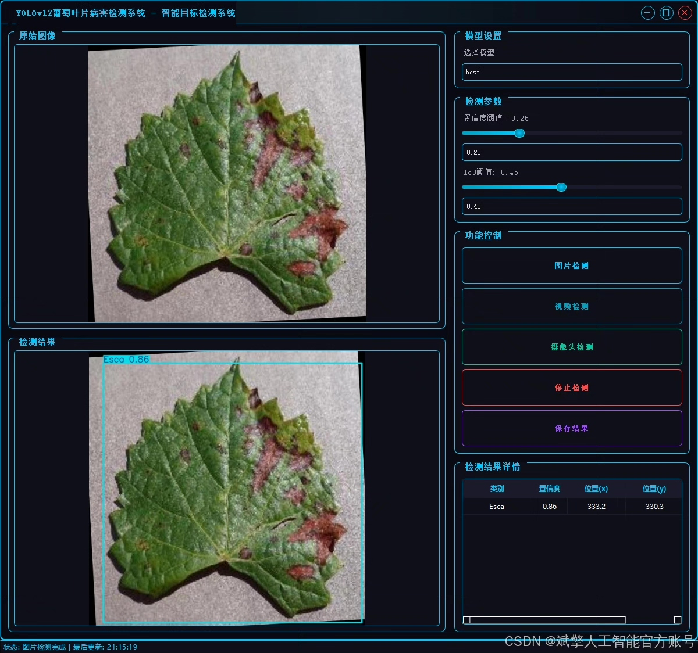
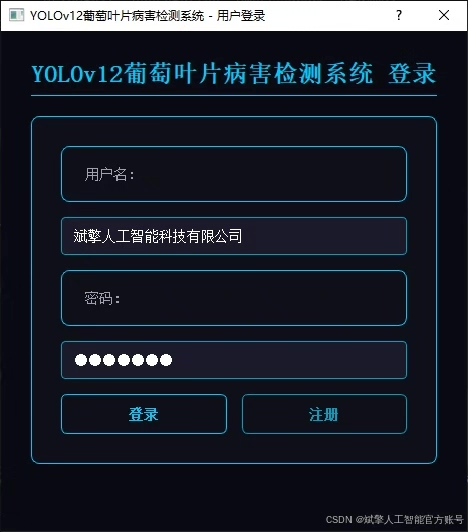
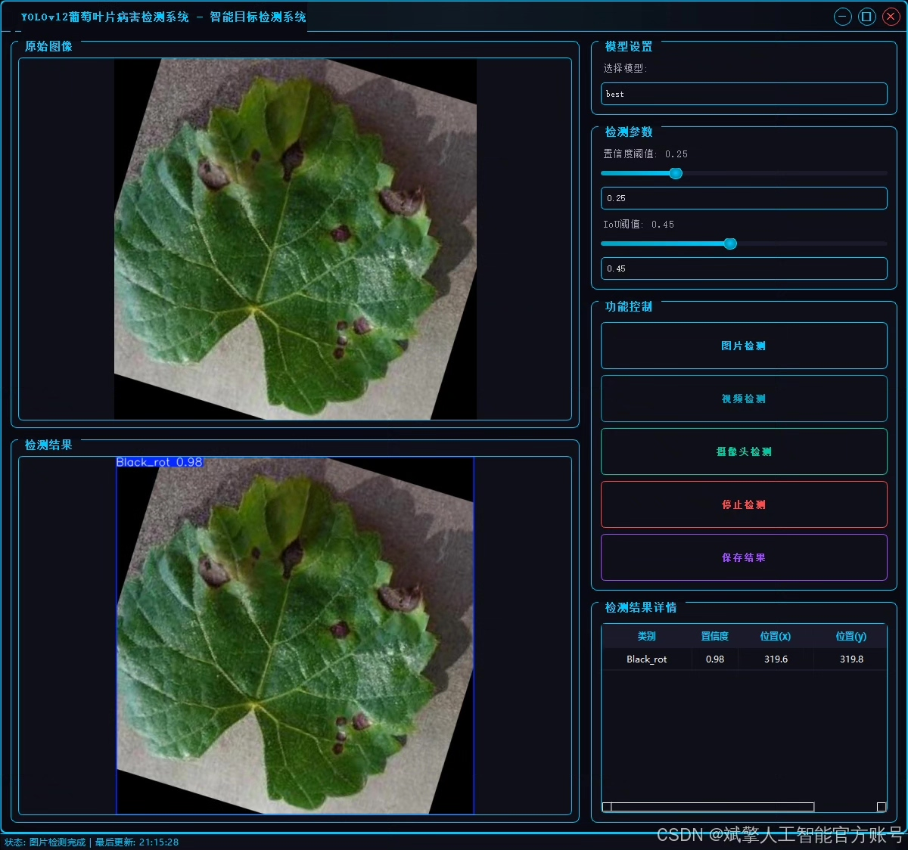
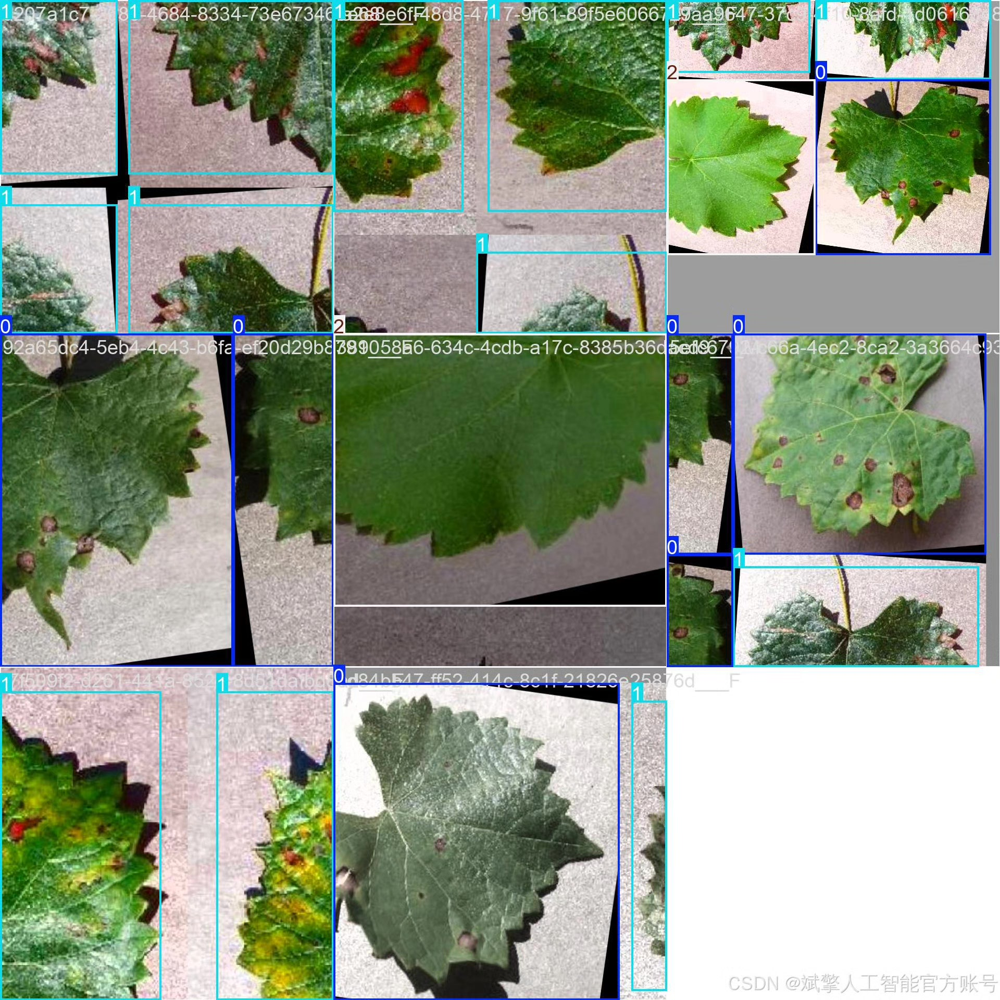
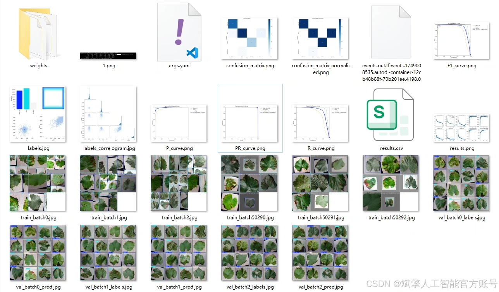
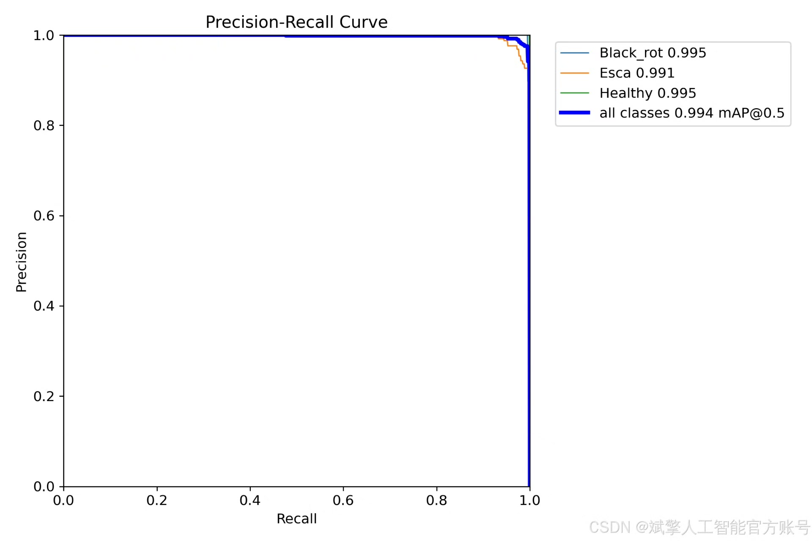
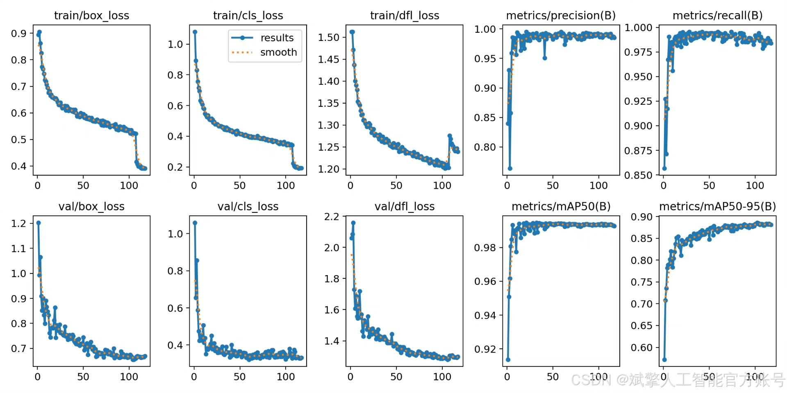
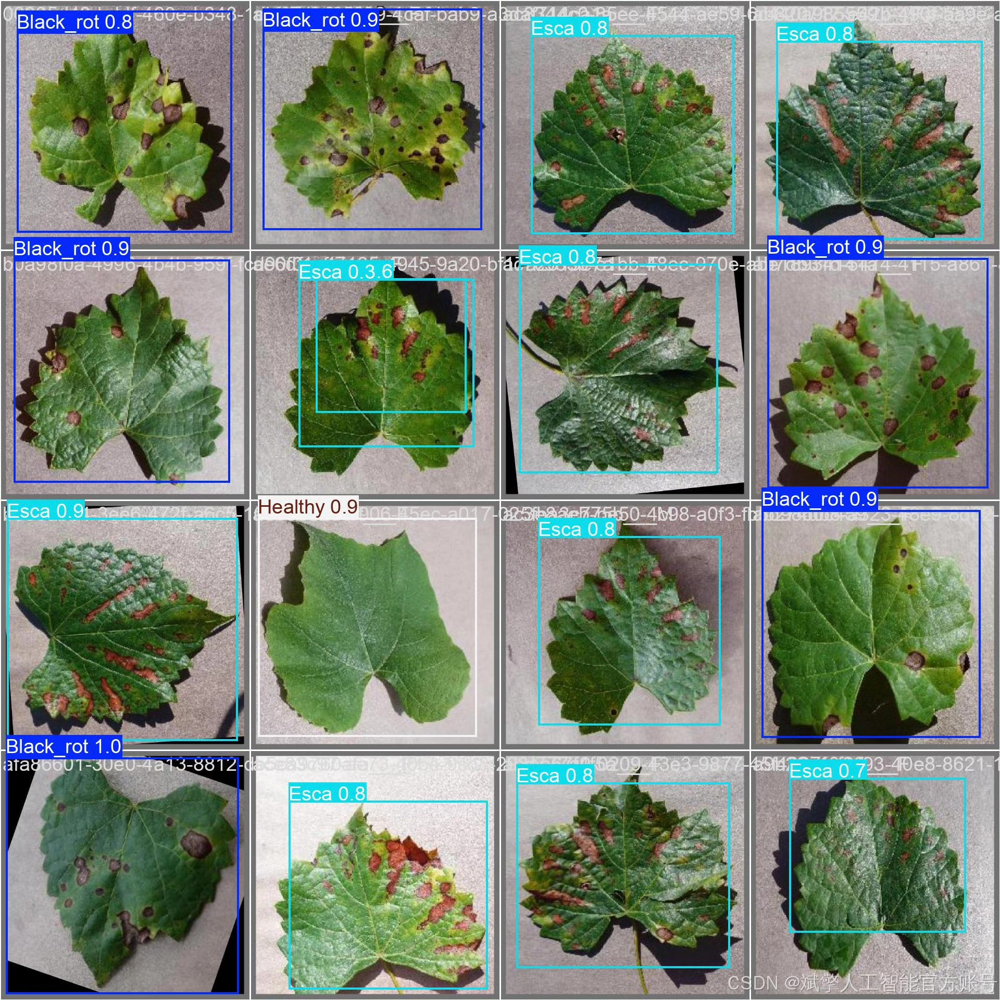

# YOLOv12 Grape Leaf Disease Identification System

## Body

YOLOv12 Grape Leaf Disease Identification System Based on Deep Learning YOLOv12: A Grape Leaf Disease Identification and Detection System (YOLOv12+YOLO dataset + UI interface + login registration interface + Python project source code + model)

Grape leaf diseases severely impact grape yield and quality. Traditional manual detection methods are inefficient and rely on experience. This paper proposes a grape leaf disease intelligent identification and detection system based on deep learning technology, achieving efficient classification and localization of Black_rot, Esca, and Healthy categories of leaves. The system employs an improved YOLOv12 model, trained on a self-built dataset containing 5370 images (3758 training, 538 validation, 1074 test), and evaluated. It integrates the PyTorch framework and a Python-developed interactive UI interface, supporting user login registration, image upload, and real-time detection functions. Experiments show that the system achieves an average precision (mAP) of 99.4% on the test set, with inference speed for each image being≤50ms, demonstrating high accuracy and real-time performance, providing an intelligent solution for precise prevention and control of grape diseases.

✅ User Login Registration: Supports password verification and security validation.
✅ Three Detection Modes: Based on the YOLOv12 model, supports image, video, and real-time camera detection, accurately identifying targets.
✅ Dual-Screen Comparison: Displays original images and detection results simultaneously on the screen.
✅ Data Visualization: Real-time table displays the category, confidence, and coordinates of detected targets.
✅ Intelligent Parameter Tuning: Offers a confidence slide bar to dynamically optimize detection accuracy, adapting to different scene requirements.
✅ Sci-Fi Interactive Interface: Dark theme paired with dynamic light effects reduce visual fatigue and enhance operational experience.

## Images

## Payment

Here is a pay link on Stripe ( https://buy.stripe.com/3cs8yP7sY87d0vu9AB ). Please contact me lonlonago@foxmail.com after funding $89, and I will send you a complete data files , thank you!

